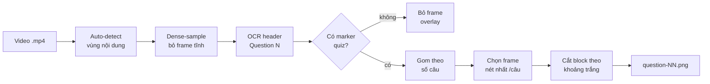

<div align="center">

# 🎯 moodle-quiz-extractor

**Trích xuất mỗi câu hỏi thành 1 ảnh riêng từ video screen-recording quiz Moodle**

_Không sót câu · Không lặp ảnh · Cắt khít từng câu · Chạy được mọi video cùng template_

[](https://github.com/MinhThang1009/moodle-quiz-extractor/actions/workflows/ci.yml)


</div>

---

## Mục lục

- [Vấn đề](#vấn-đề)
- [Tính năng](#tính-năng)
- [Yêu cầu](#yêu-cầu)
- [Cài đặt](#cài-đặt)
- [Sử dụng](#sử-dụng)
- [Xuất text (OCR ảnh câu)](#xuất-text-ocr-ảnh-câu)
- [Tự động hóa (watcher)](#tự-động-hóa-watcher)
- [Cách hoạt động](#cách-hoạt-động)
- [Cấu trúc dự án](#cấu-trúc-dự-án)
- [Giới hạn](#giới-hạn)
- [Roadmap](#roadmap)
- [Đóng góp](#đóng-góp)
- [Changelog](#changelog)
- [License](#license)

## Vấn đề

Khi quay màn hình một bài quiz Moodle (màn hình **cuộn liên tục**), việc cắt thủ công
từng câu rất mất công, và các cách tự động đơn giản (lấy frame theo nhịp, bắt lúc dừng
đọc) thường **sót câu** hoặc **lặp ảnh**. `moodle-quiz-extractor` giải đúng bài toán
này: mỗi câu hỏi → đúng **một ảnh** sạch, đầy đủ.

## Tính năng

- ✅ **Không sót câu** — quét dày toàn video, bắt mọi câu từng hiện đầy đủ (kể cả câu chỉ lướt qua).
- ✅ **Không lặp** — gom theo *số câu* (`Question N`), mỗi câu đúng 1 ảnh.
- ✅ **Ảnh nét** — chọn frame nét nhất tại vùng câu, refine frame lân cận để né motion blur khi cuộn nhanh.
- ✅ **Cắt khít** — mỗi ảnh đúng 1 block (header + đề + đáp án), tự bỏ lưới nav và header câu kế.
- ✅ **Portable** — bám cấu trúc *text* Moodle + ngưỡng theo tỉ lệ `H/W` → chạy mọi video cùng template, mọi độ phân giải, không sửa code.
- ✅ **Cache OCR** — lần đầu OCR vài phút, lần sau gần như tức thì.
- ✅ **Tự nhận diện layout** — auto-detect vùng nội dung từ video, chạy thẳng cả điện thoại dọc lẫn desktop ngang 2 cột mà không cần chỉnh config.
- ✅ **Xuất text** — OCR ảnh câu sang `questions.json` + `.md` (engine offline EasyOCR hoặc vision LLM).
- ✅ **Watcher tự động** — thả video vào `data/` là tự xử lý, hỗ trợ nhiều video song song.

## Yêu cầu

- Python **3.10+**
- Phụ thuộc: `opencv-python`, `numpy`, `easyocr` (xem [`requirements.txt`](requirements.txt))

## Cài đặt

```bash
python -m venv .venv
.venv\Scripts\activate          # Windows  •  Linux/macOS: source .venv/bin/activate
pip install -r requirements.txt
```

## Sử dụng

```bash
# Mặc định: data/1.mp4 -> output/questions/
python -m quiz_extractor

# Video khác (cùng template Moodle):
python -m quiz_extractor --video data/2.mp4 --output output/quiz2

# OCR lại từ đầu (bỏ cache):
python -m quiz_extractor --force-ocr
```

| Tham số | Mặc định | Ý nghĩa |
|---|---|---|
| `--video` | `data/1.mp4` | Đường dẫn video `.mp4` |
| `--output` | `output/questions` | Thư mục lưu ảnh câu |
| `--cache` | `output/ocr_cache.pkl` | File cache OCR |
| `--step` | `4` | OCR mỗi `STEP` frame (nhỏ hơn = kỹ hơn, chậm hơn) |
| `--force-ocr` | `false` | Xoá cache, OCR lại từ đầu |
| `--config` | – | JSON override marker/tỉ lệ template (xem [Template khác](#template-khác)) |
| `--no-auto-crop` | `false` | Tắt tự suy vùng nội dung, dùng tỉ lệ cố định trong config |
| `-v/--verbose` | `false` | In thêm log DEBUG |
| `-q/--quiet` | `false` | Chỉ in cảnh báo/lỗi |

Kết quả: `output/questions/question-01.png`, `question-02.png`, …

> OCR in tiến độ **dạng stream** (1 dòng cập nhật tại chỗ) và chỉ giữ ~1 frame trong RAM
> (stream video, không nạp toàn bộ → không OOM video dài). Có **GPU (CUDA/MPS)** thì easyocr
> tự dùng. Thiếu câu / câu thiếu nội dung sẽ in **cảnh báo** ở cuối.

### Template khác

**Vùng nội dung (chrome trình duyệt / status bar / overlay) tự nhận diện** — chạy thẳng cả
khi đổi hẳn layout (điện thoại dọc ↔ desktop ngang, độ phân giải khác) **không cần config**.
Chỉ còn **markers ngôn ngữ** là phải override khi Moodle dùng ngôn ngữ/theme khác (vd "Câu
hỏi N"), vì không suy ra từ pixel được:

```json
{
  "QUESTION_RE": "câu hỏi\\s*(\\d{1,3})",
  "QUIZ_MARKERS": ["chưa trả lời", "đánh dấu"],
  "OCR_LANGS": ["vi"]
}
```

> Auto-crop bật mặc định; detect bất thường thì fallback tỉ lệ cố định. Muốn **ép** vùng
> nội dung thì `--no-auto-crop` rồi đặt `F_CONTENT_TOP/BOT` trong `--config`.

## Xuất text (OCR ảnh câu)

Chuyển ảnh câu thành text có cấu trúc (`output/questions.json` + `questions.md`):

```bash
# Mặc định: easyocr (offline, ~95%, sai dấu lác đác) — không thêm dep
python -m quiz_extractor.to_text

# Chính xác hơn: vision LLM (Anthropic) — cần ANTHROPIC_API_KEY + có chi phí
pip install "anthropic>=0.40"
export ANTHROPIC_API_KEY=sk-ant-...        # Windows: $env:ANTHROPIC_API_KEY="..."
python -m quiz_extractor.to_text --engine llm                 # model mặc định claude-opus-4-8
python -m quiz_extractor.to_text --engine llm --model claude-haiku-4-5   # rẻ hơn
```

> OCR không bao giờ exact 100% (dấu tiếng Việt) — nên rà lại. Engine `llm` đọc dấu +
> bố cục a/b/c/d chính xác hơn nhiều nhưng gửi ảnh ra API.

## Tự động hóa (watcher)

Thả video vào `data/` rồi đi làm việc khác — watcher tự trích ảnh (+ OCR text) ra
`output/<tên-video>/`:

```bash
python -m quiz_extractor.watch                  # theo dõi data/, OCR easyocr
python -m quiz_extractor.watch --to-text none   # chỉ trích ảnh, không OCR
python -m quiz_extractor.watch --to-text llm    # OCR vision LLM
python -m quiz_extractor.watch --once           # quét 1 lượt rồi thoát (cho cron)
python -m quiz_extractor.watch --workers 2      # xử lý 2 video song song
```

Nhiều video: thả nhiều `.mp4` vào `data/`, mỗi cái ra `output/<tên-video>/` riêng (cache
riêng). Quét bằng polling (mặc định mỗi 5s, không cần dep), chờ file copy xong mới chạy,
**bỏ qua video đã có kết quả** (dùng `--reprocess` để chạy lại). `--workers N` chạy N video
song song (mỗi video 1 process, ~1.5GB RAM/process; mặc định 1 = tuần tự). `Ctrl+C` để dừng.

## Cách hoạt động

Bám **cấu trúc text** của template Moodle thay vì vị trí pixel:



1. **Tự nhận diện vùng nội dung**: phân tích các cặp frame "cuộn thuần" để loại chrome trình duyệt / status bar / overlay — không cần cấu hình theo thiết bị.
2. Dense-sample frame toàn video, OCR (EasyOCR, vi+en) tìm header `Question N`; **bỏ qua frame tĩnh** trùng nội dung để OCR nhanh hơn.
3. Bỏ frame overlay / không phải trang quiz (vắng marker); header thật phải có marker grey-box ngay dưới (**anchor cấu trúc**, tránh nhận nhầm "Flag question").
4. Gom ứng viên theo **số câu**; mỗi câu chọn frame **nét nhất** tại vùng câu (refine ±N frame lân cận).
5. Cắt block từ header câu này tới ranh giới **khoảng trắng** trước câu kế / lưới nav.

> Chỗ duy nhất phụ thuộc template là regex marker trong
> [`quiz_extractor/config.py`](quiz_extractor/config.py); đổi LMS khác chỉ cần sửa ở đó.

## Cấu trúc dự án

```text
.
├── quiz_extractor/        # package chính
│   ├── config.py          # marker template Moodle, tỉ lệ layout, hằng số ảnh
│   ├── geometry.py        # suy ngưỡng pixel từ (H, W) video
│   ├── ocr.py             # đọc video, auto-detect vùng nội dung, OCR header, cache
│   ├── imaging.py         # đo độ nét theo block, refine frame nét nhất
│   ├── extractor.py       # orchestration: video -> 1 ảnh/câu
│   ├── to_text.py         # OCR ảnh câu -> text (easyocr / vision LLM)
│   ├── watch.py           # watcher tự chạy pipeline khi có video mới
│   └── __main__.py        # CLI
├── tests/                 # pytest (geometry, ocr, imaging, extractor, detect, ...)
├── data/                  # video đầu vào (gitignored)
├── output/                # ảnh câu + cache (gitignored)
├── .github/               # CI/release workflows, dependabot, issue/PR templates
├── README.md
├── CHANGELOG.md
├── CONTRIBUTING.md
├── CODE_OF_CONDUCT.md
├── SECURITY.md
├── SUPPORT.md
├── LICENSE
├── pyproject.toml
└── requirements.txt
```

## Giới hạn

Không trích được nội dung **chưa từng được quay**. Ví dụ trong `1.mp4`, câu cuối (Q42)
chỉ được quay phần header rồi người quay tắt recording, nên ảnh Q42 thiếu phần đáp án —
cần quay lại đoạn đó. Tương tự, đoạn cuộn quá nhanh bị motion blur thì ảnh chọn ra sẽ
kém nét hơn (thuật toán đã chọn frame nét nhất có thể).

## Roadmap

- [x] Xuất text từ ảnh câu (`questions.json` + `.md`, EasyOCR / vision LLM).
- [x] Tự nhận diện vùng nội dung — chạy mọi layout không cần config.
- [x] GPU auto-detect cho EasyOCR.
- [ ] Khử nhiễu ảnh trước OCR (giảm sai dấu ở câu mờ).
- [ ] Hỗ trợ thêm template LMS khác (Google Forms, Azota…) qua file cấu hình marker.
- [ ] Xuất PDF gộp tất cả câu.

## Đóng góp

Xem [CONTRIBUTING.md](CONTRIBUTING.md). Mọi issue/PR đều được hoan nghênh.

## Changelog

Xem [CHANGELOG.md](CHANGELOG.md) (theo [Keep a Changelog](https://keepachangelog.com) + [SemVer](https://semver.org)).

## License

Phát hành theo giấy phép [MIT](LICENSE).
