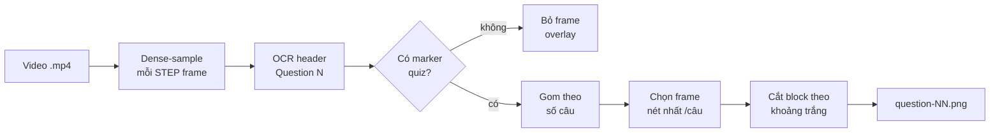

<div align="center">

# 🎯 quiz-extractor

**Trích xuất mỗi câu hỏi thành 1 ảnh riêng từ video screen-recording quiz Moodle**

_Không sót câu · Không lặp ảnh · Cắt khít từng câu · Chạy được mọi video cùng template_


</div>

---

## Mục lục

- [Vấn đề](#vấn-đề)
- [Tính năng](#tính-năng)
- [Yêu cầu](#yêu-cầu)
- [Cài đặt](#cài-đặt)
- [Sử dụng](#sử-dụng)
- [Cách hoạt động](#cách-hoạt-động)
- [Cấu trúc dự án](#cấu-trúc-dự-án)
- [Giới hạn](#giới-hạn)
- [Roadmap](#roadmap)
- [Đóng góp](#đóng-góp)
- [Changelog](#changelog)
- [License](#license)

## Vấn đề

Khi quay màn hình một bài quiz Moodle (màn hình **cuộn liên tục**), việc cắt thủ công
từng câu rất mất công, và các cách tự động đơn giản (lấy frame theo nhịp, bắt lúc dừng
đọc) thường **sót câu** hoặc **lặp ảnh**. `quiz-extractor` giải đúng bài toán này: mỗi
câu hỏi → đúng **một ảnh** sạch, đầy đủ.

## Tính năng

- ✅ **Không sót câu** — quét dày toàn video, bắt mọi câu từng hiện đầy đủ (kể cả câu chỉ lướt qua).
- ✅ **Không lặp** — gom theo *số câu* (`Question N`), mỗi câu đúng 1 ảnh.
- ✅ **Ảnh nét** — chọn frame nét nhất tại vùng câu, refine frame lân cận để né motion blur khi cuộn nhanh.
- ✅ **Cắt khít** — mỗi ảnh đúng 1 block (header + đề + đáp án), tự bỏ lưới nav và header câu kế.
- ✅ **Portable** — bám cấu trúc *text* Moodle + ngưỡng theo tỉ lệ `H/W` → chạy mọi video cùng template, mọi độ phân giải, không sửa code.
- ✅ **Cache OCR** — lần đầu OCR vài phút, lần sau gần như tức thì.

## Yêu cầu

- Python **3.10+**
- Phụ thuộc: `opencv-python`, `numpy`, `easyocr` (xem [`requirements.txt`](requirements.txt))

## Cài đặt

```bash
python -m venv .venv
.venv\Scripts\activate          # Windows  •  Linux/macOS: source .venv/bin/activate
pip install -r requirements.txt
```

## Sử dụng

```bash
# Mặc định: data/1.mp4 -> output/questions/
python -m quiz_extractor

# Video khác (cùng template Moodle):
python -m quiz_extractor --video data/2.mp4 --output output/quiz2

# OCR lại từ đầu (bỏ cache):
python -m quiz_extractor --force-ocr
```

| Tham số | Mặc định | Ý nghĩa |
|---|---|---|
| `--video` | `data/1.mp4` | Đường dẫn video `.mp4` |
| `--output` | `output/questions` | Thư mục lưu ảnh câu |
| `--cache` | `output/ocr_cache.pkl` | File cache OCR |
| `--step` | `4` | OCR mỗi `STEP` frame (nhỏ hơn = kỹ hơn, chậm hơn) |
| `--force-ocr` | `false` | Xoá cache, OCR lại từ đầu |

Kết quả: `output/questions/question-01.png`, `question-02.png`, …

## Cách hoạt động

Bám **cấu trúc text** của template Moodle thay vì vị trí pixel:



1. Dense-sample frame toàn video, OCR (EasyOCR, vi+en) tìm header `Question N`.
2. Bỏ frame overlay / không phải trang quiz (vắng marker `Marked out of`, `Flag question`).
3. Gom ứng viên theo **số câu**; mỗi câu chọn frame **nét nhất** tại vùng câu (refine ±N frame lân cận).
4. Cắt block từ header câu này tới ranh giới **khoảng trắng** trước câu kế / lưới nav.

> Chỗ duy nhất phụ thuộc template là regex marker trong
> [`quiz_extractor/config.py`](quiz_extractor/config.py); đổi LMS khác chỉ cần sửa ở đó.

## Cấu trúc dự án

```text
.
├── quiz_extractor/        # package chính
│   ├── config.py          # đường dẫn, marker template Moodle, tỉ lệ layout, hằng số ảnh
│   ├── geometry.py        # suy ngưỡng pixel từ (H, W) video
│   ├── ocr.py             # đọc video, OCR header, cache
│   ├── imaging.py         # đo độ nét theo block, ranh giới block, refine frame nét nhất
│   ├── extractor.py       # orchestration: video -> 1 ảnh/câu
│   └── __main__.py        # CLI
├── data/                  # video đầu vào (gitignored)
├── output/                # ảnh câu + cache (gitignored)
├── README.md
├── CHANGELOG.md
├── CONTRIBUTING.md
├── LICENSE
├── pyproject.toml
└── requirements.txt
```

## Giới hạn

Không trích được nội dung **chưa từng được quay**. Ví dụ trong `1.mp4`, câu cuối (Q42)
chỉ được quay phần header rồi người quay tắt recording, nên ảnh Q42 thiếu phần đáp án —
cần quay lại đoạn đó. Tương tự, đoạn cuộn quá nhanh bị motion blur thì ảnh chọn ra sẽ
kém nét hơn (thuật toán đã chọn frame nét nhất có thể).

## Roadmap

- [ ] Tự upscale + khử nhiễu ảnh để OCR lại nội dung câu (xuất kèm text).
- [ ] Hỗ trợ thêm template LMS khác (Google Forms, Azota…) qua file cấu hình marker.
- [ ] Xuất PDF gộp tất cả câu.
- [ ] Tùy chọn GPU cho EasyOCR.

## Đóng góp

Xem [CONTRIBUTING.md](CONTRIBUTING.md). Mọi issue/PR đều được hoan nghênh.

## Changelog

Xem [CHANGELOG.md](CHANGELOG.md) (theo [Keep a Changelog](https://keepachangelog.com) + [SemVer](https://semver.org)).

## License

Phát hành theo giấy phép [MIT](LICENSE).
